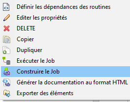

# Talend Job Manager

A tool for manage Talend job (zip format) for your application.

[](https://php.net/)
[](https://www.talend.com/fr/products/talend-open-studio/)

## Installation

You can install this lib in your PHP project using composer:

    composer require inzh/talend-job-manager

## Build your job

On first, you need to build your job with Talend, tested with Talend Open Studio. 

Just right click on your job and select in menu:



File output example:

```bash
myjobname_0.1.zip
```
## Development:

You can use directly executor class in your code, for example:


- For add or update job in repository

```php
use inzh\talend\job\manager\executor\SimpleJobExecutor;

$path = "myjobname_0.1.zip"; // Your job zip file 
$repositoryPath = "jobs"; // Your repository path

SimpleJobExecutor::put($path, $repositoryPath);
```

- To run the latest version of job :

```php
use inzh\talend\job\manager\executor\SimpleJobExecutor;

$jobName = "myjobname"; // Your job name
$repositoryPath = "jobs"; // Your repository path
$parameters = ["contextparam1" => "value1", "contextparam2" => "value2"]; // Context parameters passed to job

$output = SimpleJobExecutor::execute($jobName, $parameters, $repositoryPath);
print_r($output);
```

- To run the specific version of job :

```php
use inzh\talend\job\manager\executor\SimpleJobExecutor;

$jobName = "myjobname"; // Your job name
$repositoryPath = "jobs"; // Your repository path
$parameters = ["contextparam1" => "value1", "contextparam2" => "value2"]; // Context parameters passed to job
$version = 0.1;

$output = SimpleJobExecutor::execute($jobName, $parameters, $repositoryPath, $version);
print_r($output);
```
#

[© 2011-2022 [InZH] Studio.](https://www.inzh.fr/)